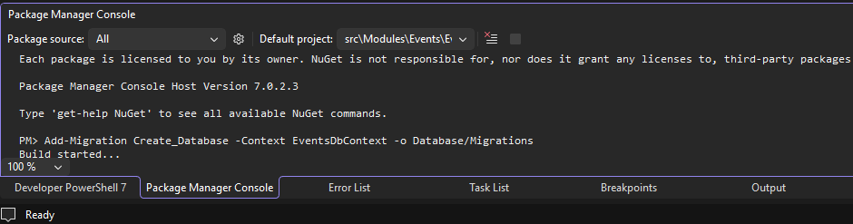
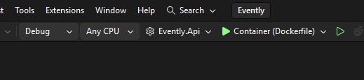

# Entity Framework Core Migrations Documentation

This documentation explains how to perform Entity Framework Core migrations 
for the Evently modular monolith project using the Package Manager Console 
in Visual Studio.

## Table of Contents
- [Entity Framework Core Migrations Documentation](#entity-framework-core-migrations-documentation)
  - [Table of Contents](#table-of-contents)
  - [Prerequisites](#prerequisites)
  - [Configuration](#configuration)
    - [Set Default Project](#set-default-project)
    - [Set Startup Project](#set-startup-project)
  - [Adding a Migration](#adding-a-migration)
    - [Optional: With Explicit Projects](#optional-with-explicit-projects)
  - [Automatic Migration Application](#automatic-migration-application)
    - [How It Works](#how-it-works)
  - [Reverting a Migration](#reverting-a-migration)
    - [Step 1: Update Database to Previous Migration](#step-1-update-database-to-previous-migration)
    - [Step 2: Remove the Migration](#step-2-remove-the-migration)
    - [Optional: With Explicit Projects](#optional-with-explicit-projects-1)
  - [Manual Database Update (Non-Development)](#manual-database-update-non-development)
  - [Troubleshooting](#troubleshooting)
    - [Foreign Key Constraint Violations](#foreign-key-constraint-violations)

## Prerequisites

Before executing migrations, ensure that you have the 
`Microsoft.EntityFrameworkCore.Tools` package installed in the 
`Evently.Modules.Events.Infrastructure` project.

## Configuration

To use the commands without having to pass the `StartupProject` and `Project` 
parameters every time, configure Visual Studio as follows:

### Set Default Project

In the **Package Manager Console** window, under the **Default project** 
dropdown, select `src\Modules\Events\Evently.Modules.Events.Infrastructure` (the project containing 
your DbContext).



### Set Startup Project

Set `Evently.Api` as the **Startup Project**. This can be done from the 
**Solution Explorer** or the **Toolbar**.

**Toolbar:**



## Adding a Migration

To add a new migration, execute the following command in the Package Manager 
Console. Replace `<MigrationName>` with a descriptive name for your migration.

```powershell
Add-Migration <MigrationName> -Context EventsDbContext -o Database/Migrations
```

**Example:**

```powershell
Add-Migration Create_Database -Context EventsDbContext -o Database/Migrations
```

**Parameters:**
- `-Context EventsDbContext`: Specifies which DbContext to use
- `-o Database/Migrations`: Output directory for the migration files

### Optional: With Explicit Projects

If you haven't configured the default and startup projects, you can specify 
them explicitly:

```powershell
Add-Migration <MigrationName> -Project Evently.Modules.Events.Infrastructure -StartupProject Evently.Api -Context EventsDbContext -o Database/Migrations
```

## Automatic Migration Application

This project is configured to **automatically apply pending migrations** when 
running in the Development environment. The migrations are applied in 
`Program.cs`:

```csharp
if (app.Environment.IsDevelopment()) 
{ 
    app.UseSwagger(); 
    app.UseSwaggerUI();
    
    app.ApplyMigrations(); // Automatically applies pending migrations
}
```

### How It Works

The `ApplyMigrations()` extension method:
1. Creates a service scope
2. Resolves the `EventsDbContext`
3. Calls `context.Database.Migrate()` to apply any pending migrations

**Important:** Migrations are only applied automatically in Development. For 
other environments, you need to apply them manually using the 
`Update-Database` command.

## Reverting a Migration

To revert the last migration:

### Step 1: Update Database to Previous Migration

First, update the database to the penultimate migration. Replace 
`<PreviousMigrationName>` with the name of the migration you want to revert to.

```powershell
Update-Database <PreviousMigrationName> -Context EventsDbContext
```

### Step 2: Remove the Migration

Then, remove the migration from your code:

```powershell
Remove-Migration -Context EventsDbContext
```

**Example:**

If your migrations are `Create_Database` and `Add_Categories_Table`, and you 
want to revert `Add_Categories_Table`:

```powershell
Update-Database Create_Database -Context EventsDbContext
Remove-Migration -Context EventsDbContext
```

### Optional: With Explicit Projects

```powershell
Update-Database <PreviousMigrationName> -Project Evently.Modules.Events.Infrastructure -StartupProject Evently.Api -Context EventsDbContext
Remove-Migration -Project Evently.Modules.Events.Infrastructure -StartupProject Evently.Api -Context EventsDbContext
```

## Manual Database Update (Non-Development)

If you need to manually update the database (e.g., in staging or production), 
use the following command:

```powershell
Update-Database -Context EventsDbContext
```

This applies all pending migrations to the database.

## Troubleshooting

### Foreign Key Constraint Violations

If you encounter foreign key constraint errors during migration, ensure that:
1. Your entity configurations are properly set up
2. The migration order is correct (parent tables before child tables)
3. There's no corrupted data in the database

**Solution:** Drop and recreate the database in development:

```powershell
# Drop the database
Drop-Database -Context EventsDbContext

# Remove all migrations
Remove-Item -Path "src\Evently.Modules.Events.Infrastructure\Database\Migrations" -Recurse

# Create a new initial migration
Add-Migration InitialCreate -Context EventsDbContext -o Database/Migrations

# Run the application (migrations will apply automatically in Development)
```
